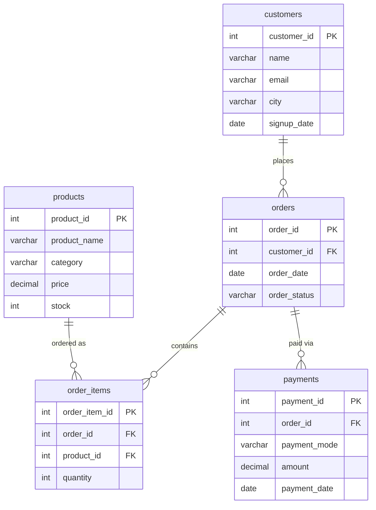

# MySQL E-Commerce Database & Analytics

A relational database design and SQL analytics project simulating a small e-commerce platform — covering schema design, sample data generation, and revenue/payment analytics using window functions and aggregate rollups.

Built as part of [CodeWithHarry's Ultimate Job-Ready AI-Powered Data Analytics Course](https://www.codewithharry.com/).

---

## Overview

This project models a simplified e-commerce business (`shop` database) with customers, products, orders, order line items, and payments. On top of the schema, it implements four analytical SQL queries that answer common business questions: cumulative revenue trends, category-level performance, top-selling products, and payment mode distribution.

**Tech stack:** MySQL 8.x, ANSI SQL window functions, `GROUP BY ... WITH ROLLUP`

---

## Database Schema



| Table | Purpose |
|---|---|
| `customers` | Registered customers and their signup/location details |
| `products` | Product catalog with category, price, and stock |
| `orders` | One row per order, linked to a customer, with a status (`Delivered`, `Pending`, `Cancelled`) |
| `order_items` | Line items per order (product + quantity) — enables many-to-many between orders and products |
| `payments` | Payment record per order, including mode and amount |

---

## Folder Structure

```
mysql-ecommerce-analytics/
├── README.md
├── schema/
│   ├── 01_create_tables.sql      -- table definitions + foreign keys
│   └── 02_insert_data.sql        -- sample seed data
└── queries/
    ├── 01_rolling_total_payments.sql   -- cumulative running total (window function)
    ├── 02_revenue_by_category.sql      -- category revenue (WITH ROLLUP)
    ├── 03_revenue_by_product.sql       -- top-selling products (joins + ranking)
    ├── 04_payment_mode_distribution.sql -- payment mode totals (WITH ROLLUP)
    └── 05_customer_spend_ranking.sql    -- customer ranking (DENSE_RANK)
```

---

## Setup & Execution

**Prerequisites:** MySQL 8.0+ (for window function support) and a MySQL client (CLI, MySQL Workbench, or similar).

1. **Clone the repo**
   ```bash
   git clone https://github.com/Praveen0079/mysql-ecommerce-analytics.git
   cd mysql-ecommerce-analytics
   ```

2. **Create the database**
   ```sql
   CREATE DATABASE shop;
   ```

3. **Build the schema**
   ```bash
   mysql -u root -p shop < schema/01_create_tables.sql
   ```

4. **Load the sample data**
   ```bash
   mysql -u root -p shop < schema/02_insert_data.sql
   ```

5. **Run any analytical query**
   ```bash
   mysql -u root -p shop < queries/rolling_total_payments.sql
   ```

   Or open the `.sql` files directly in MySQL Workbench / DBeaver and run them against the `shop` database.

---

## Analytical Queries

### 1. Cumulative Running Total — Window Function
**File:** `queries/01_rolling_total_payments.sql`

```sql
SELECT *, SUM(amount) OVER (
    ORDER BY payment_date
    ROWS BETWEEN UNBOUNDED PRECEDING AND CURRENT ROW
) AS rolling_total
FROM payments;
```
Calculates a day-by-day cumulative revenue total using `SUM() OVER (ORDER BY ...)`, without collapsing individual payment rows — useful for tracking revenue growth over time.

### 2. Category Revenue Summary — `WITH ROLLUP`
**File:** `queries/02_revenue_by_category.sql`

```sql
SELECT p.category, SUM(oi.quantity * p.price) AS Sales
FROM products p
JOIN order_items oi ON p.product_id = oi.product_id
GROUP BY p.category WITH ROLLUP;
```
Joins products to order items to compute revenue per category, then appends a grand-total row via `WITH ROLLUP` — a quick way to get subtotals and a total in one pass.

### 3. Top-Selling Products — Multi-Table Join Ranking
**File:** `queries/03_revenue_by_product.sql`

```sql
SELECT p.product_name, SUM(oi.quantity * p.price) AS revenue
FROM order_items oi
JOIN products p ON p.product_id = oi.product_id
JOIN orders o ON o.order_id = oi.order_id
GROUP BY p.product_name
ORDER BY revenue DESC;
```
A three-table join (`order_items` → `products` → `orders`) that ranks products by total revenue generated, highlighting best-sellers.

### 4. Payment Mode Distribution — `WITH ROLLUP`
**File:** `queries/04_payment_mode_distribution.sql`

```sql
SELECT payment_mode, SUM(amount) AS total
FROM payments
GROUP BY payment_mode WITH ROLLUP;
```
Breaks down total revenue by payment method (UPI, Credit Card, Debit Card) with a grand-total row, useful for understanding customer payment preferences.

### 5. Customer Spend Ranking — `DENSE_RANK()`
**File:** `queries/05_customer_spend_ranking.sql`

```sql
SELECT customer_name, total_spent, drk
FROM (
    SELECT
        c.name AS customer_name,
        SUM(oi.quantity * p.price) AS total_spent,
        DENSE_RANK() OVER (
            ORDER BY SUM(oi.quantity * p.price) DESC
        ) AS drk
    FROM customers c
    JOIN orders o ON o.customer_id = c.customer_id
    JOIN order_items oi ON oi.order_id = o.order_id
    JOIN products p ON p.product_id = oi.product_id
    GROUP BY c.name
) AS ranked_customers;
```
Joins across all four supporting tables to compute each customer's total spend, then ranks customers with `DENSE_RANK()` — unlike `RANK()`, ties share the same rank with no gaps in the sequence that follows, making it well-suited for leaderboard-style reporting (e.g., "top spenders" lists) where skipped ranks would look odd.

---

## Key Learnings & Skills Demonstrated

- Relational schema design with primary/foreign key constraints across 5 normalized tables
- SQL window functions (`SUM() OVER`, `DENSE_RANK() OVER`, frame clauses with `ROWS BETWEEN`)
- Aggregate reporting with `GROUP BY ... WITH ROLLUP` for subtotal/grand-total summaries
- Multi-table joins (2–4 tables) to answer business questions across a normalized schema
- Structuring a SQL project for readability and version control (schema/queries separation)

---

## Attribution

Built while completing the SQL and analytics modules of CodeWithHarry's *Ultimate Job-Ready AI-Powered Data Analytics Course*.
